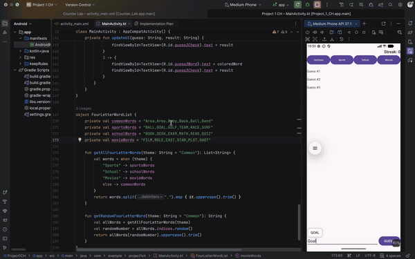

# Wordle Game - Mobile App Project 1

A fully functional, 4-letter Wordle clone built for Android using Kotlin and ConstraintLayout.

## Description
This app challenges users to guess a hidden 4-letter word within three attempts. It features themed word banks, real-time feedback using color-coded text, and a win-streak tracker to keep players engaged.

## Features

### Core Features
- [x] **Word Guessing:** Users can enter 4-letter words to guess a hidden target.
- [x] **Feedback Logic:** Provides feedback for each letter:
    - `O`: Correct letter, correct position.
    - `+`: Correct letter, wrong position.
    - `X`: Letter not in word.
- [x] **UI Updates:** The board updates dynamically with each guess.
- [x] **ConstraintLayout:** Built with a responsive, modern layout.
- [x] **EditText Processing:** Handles user input with proper validation and filtering.

### Stretch Features
- [x] **Themed Word Lists:** Toggle between Common, Sports, School, and Movie themes.
- [x] **Spannable Text:** The guessed word itself changes color (Green/Yellow/Gray) to show correctness.
- [x] **Win Visuals:** Displays a Star icon (⭐) upon a successful guess.
- [x] **Win Streak:** Tracks consecutive wins; resets on a "Game Over."
- [x] **Reset Functionality:** Play again instantly with a new word without restarting the app.
- [x] **Advanced Validation:** 
    - Ensures guesses are exactly 4 letters.
    - Filters out non-alphabetical characters (A-Z).
    - Verifies guesses against the specific themed word bank.

## Walkthrough Video/GIF 

### Full Video Walkthrough
[Watch the full walkthrough on Google Drive](https://drive.google.com/file/d/1jlCBBsNVwM6igihggq8kKr96Gsgp6HwW/view?usp=sharing)

### App Demo

## Files Overview
- **MainActivity.kt:** Contains the game logic, theme management, and the `FourLetterWordList` word bank.
- **activity_main.xml:** Defines the ConstraintLayout-based UI, including buttons, inputs, and guess rows.

## How to Run
1. Clone the repository.
2. Open in Android Studio.
3. Build and run on an emulator or physical device.
